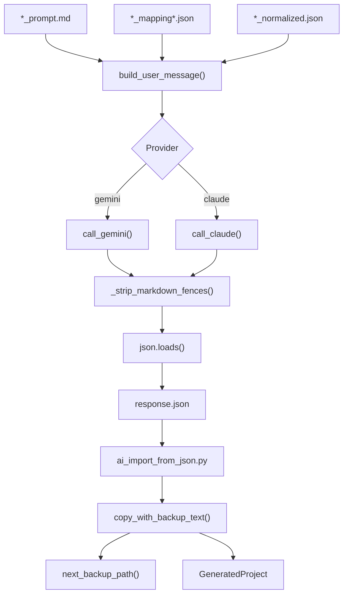

# AI Completion - Architecture

Description: Flux d'envoi au modele IA et import des fichiers generes dans le projet.

## Node details

| Noeud | Correspond a | Contient | Demande | Renvoie |
| --- | --- | --- | --- | --- |
| Prompt | Prompt markdown | Instructions + contexte | Fichier _prompt.md | Texte prompt |
| Mapping | Mapping JSON | Controllers/services/repos | Fichiers *_mapping*.json | Texte JSON |
| Entities | Entities JSON | Classes normalisees | *_normalized.json | Texte JSON |
| BuildMsg | build_user_message | Message final | prompt + mapping + entities | Texte user_message |
| CallModel | Selection provider | Choix gemini/claude | provider + config | Route vers API |
| CallGemini | call_gemini | HTTP request | api_key + model + message | Texte brut |
| CallClaude | call_claude | HTTP request | api_key + model + message | Texte brut |
| Strip | _strip_markdown_fences | Nettoyage | Texte brut | Texte JSON brut |
| ParseJson | json.loads | Parsing | Texte JSON brut | Dict parse |
| SaveJson | response.json | Ecriture disque | Dict parse | Fichier JSON |
| Import | ai_import_from_json.py | Import fichiers | response.json + project_root | Log import |
| Copy | copy_with_backup_text | Ecriture fichier | content + path | Fichier ecrit |
| Backup | next_backup_path | Chemin backup | Path dst | Path backup |
| OutputProject | GeneratedProject | Projet cible | Fichiers importes | Arborescence mise a jour |
