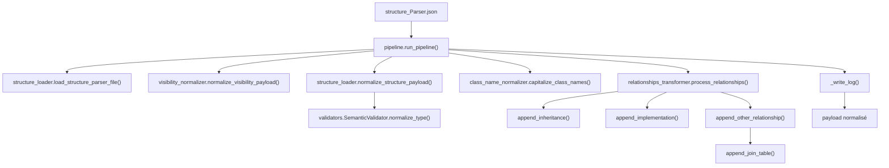

## Node details

 | Noeud | Correspond a | Contient | Demande | Renvoie |
  | --- | --- | --- | --- | --- |
  | InputStruct | Sortie du Parser | structure_Parser.json | fichier JSON | payload brut |
  | RunPipeline | Semantic_Analyzer/pipeline.py run_pipeline | Orchestration globale | path, language, known_types | payload normalisé |
  | LoadStruct | Semantic_Analyzer/structure_loader.py load_structure_parser_file | Chargement JSON | path | dict payload |
  | NormalizeVisibility | Semantic_Analyzer/visibility_normalizer.py normalize_visibility_payload | Mapping +/−/#/~ | payload classes | payload visibilités |
  | NormalizeTypes | Semantic_Analyzer/structure_loader.py normalize_structure_payload | Normalise types + filtre placeholders | payload + language | payload types |
  | SemanticValidator | Semantic_Analyzer/validators.py SemanticValidator.normalize_type | Tables canoniques + génériques + arrays | type brut + known types | type canonique |
  | NormalizeNames | Semantic_Analyzer/class_name_normalizer.py capitalize_class_names | Capitalisation + propagation relations | payload classes | payload renommé |
  | TransformRelations | Semantic_Analyzer/relationships_transformer.py process_relationships | Relations UML → extends/implements/attrs | payload classes | payload enrichi |
  | Inheritance | append_inheritance | Ajoute extends | classe + parent | type mis à jour |
  | Implementation | append_implementation | Ajoute implements + copie méthodes | classe + interface | type + méthodes |
  | OtherRelations | append_other_relationship | Associations/agg/compo | classe source/target + cardinalités | attributs ajoutés |
  | JoinTable | append_join_table | Classe de jointure ↔ | source/target + label | nouvelle classe |
  | WriteLog | Semantic_Analyzer/pipeline.py _write_log | Log normalisation | log list | /tmp/normalization_log.txt |
  | OutputPayload | Résultat pipeline | payload prêt codegen | payload | JSON normalisé |