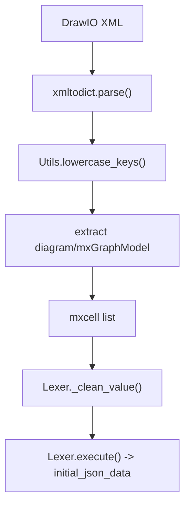

# Lexer - Architecture

Description: Flux de traitement du module Lexer, de l'XML DrawIO jusqu'a la liste de cellules JSON.

## Node details

| Noeud | Correspond a | Contient | Demande | Renvoie |
| --- | --- | --- | --- | --- |
| InputXml | Fichier DrawIO brut | XML source | Chemin du fichier | Texte XML |
| ParseXml | xmltodict.parse | Arbre JSON/XML | Texte XML | Dict Python |
| Lowercase | Utils.lowercase_keys | Cles en minuscules | Dict parse | Dict normalise |
| ExtractDiagram | Extraction mxGraphModel | Partie diagramme | Dict normalise | Liste mxcell |
| Cells | Liste de cellules | Dicts de cellules | mxGraphModel | Liste mxcell |
| CleanValues | Lexer._clean_value | Valeurs nettoyees | Liste mxcell | Liste mxcell nettoyee |
| OutputCells | Lexer.execute | Sortie finale | Liste mxcell nettoyee | initial_json_data |
