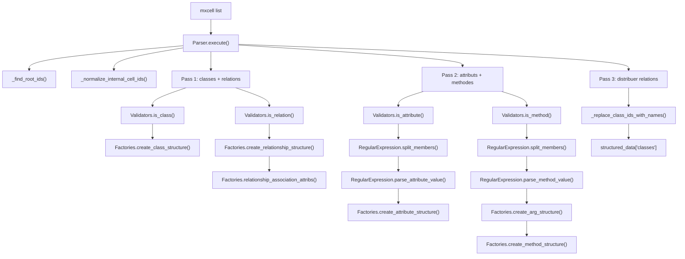

# Parser - Architecture
    
Description: Flux de traitement du module Parser, de la liste de cellules vers la structure "classes" normalisee.

## Node details

| Noeud | Correspond a | Contient | Demande | Renvoie |
| --- | --- | --- | --- | --- |
| InputCells | Sortie du Lexer | Liste mxcell | initial_json_data | Liste mxcell |
| Execute | Parser.execute | Orchestration globale | Liste mxcell | Dict classes |
| FindRoots | _find_root_ids | root_id, sub_root_id | Liste mxcell | Tuple ids |
| NormalizeIds | _normalize_internal_cell_ids | Mapping id interne -> parent | Liste mxcell + sub_root_id | Liste mxcell modifiee |
| Pass1 | 1er passage | Boucle classes/relations | Liste mxcell | Classes + relations brutes |
| IsClass | Validators.is_class | Test classe | Cellule + sub_root_id | Bool |
| CreateClass | Factories.create_class_structure | Nom/type/containers | Cellule classe | Dict classe |
| IsRelation | Validators.is_relation | Test relation | Cellule + sub_root_id | Bool |
| CreateRelation | Factories.create_relationship_structure | Relation brute | Cellule relation | Dict relation |
| AssocAttribs | Factories.relationship_association_attribs | Nom + cardinalites | Cellule relation + cellules | Relation enrichie |
| Pass2 | 2e passage | Boucle attributs/methodes | Cellules restantes | Attributs/methodes |
| IsAttribute | Validators.is_attribute | Test attribut | Cellule + sub_root_id | Bool |
| SplitAttrs | RegularExpression.split_members | Segments attributs | @value brut | Liste segments |
| ParseAttr | RegularExpression.parse_attribute_value | visibility/name/type | Segment attribut | Tuple attr |
| BuildAttr | Factories.create_attribute_structure | Dict attribut | Tuple attr | Dict attribut |
| IsMethod | Validators.is_method | Test methode | Cellule + sub_root_id | Bool |
| SplitMethods | RegularExpression.split_members | Segments methodes | @value brut | Liste segments |
| ParseMethod | RegularExpression.parse_method_value | signature methode | Segment methode | Tuple methode |
| BuildArgs | Factories.create_arg_structure | Parametre | Texte arg | Dict param |
| BuildMethod | Factories.create_method_structure | Dict methode | Signature + args | Dict methode |
| Pass3 | 3e passage | Distribution relations | Relations temporaires | Relations par classe |
| ReplaceIds | _replace_class_ids_with_names | Remplacement ids | Dict classes | Dict classes renomme |
| OutputStruct | structured_data['classes'] | Structure finale | Dict classes renomme | Payload classes |
