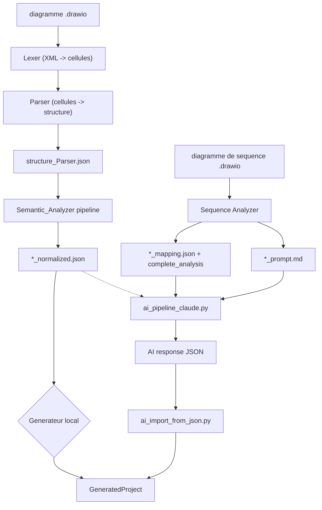

# Parser, Lexer, and AI Code Completion Flow

Description: Flux detaille du parsing UML (lexer + parser) et du complement de code via reponse IA et import.

```mermaid
flowchart TD
    Drawio["diagramme .drawio"] --> Lexer["Lexer (XML -> cellules)"]
    Lexer --> Parser["Parser (cellules -> structure)"]
    Parser --> StructJson["structure_Parser.json"]
    StructJson --> SemPipeline["Semantic_Analyzer pipeline"]
    SemPipeline --> NormalizedJson["*_normalized.json"]

    NormalizedJson --> CodeGen{Generateur local}
    CodeGen --> GeneratedProject["GeneratedProject"]

    SeqDiagram["diagramme de sequence .drawio"] --> SeqAnalyzer["Sequence Analyzer"]
    SeqAnalyzer --> MappingJson["*_mapping.json + complete_analysis"]
    SeqAnalyzer --> PromptMd["*_prompt.md"]

    PromptMd --> AIPipeline["ai_pipeline_claude.py"]
    MappingJson --> AIPipeline
    NormalizedJson -.-> AIPipeline

    AIPipeline --> AIResponse["AI response JSON"]
    AIResponse --> Importer["ai_import_from_json.py"]
    Importer --> GeneratedProject
```
