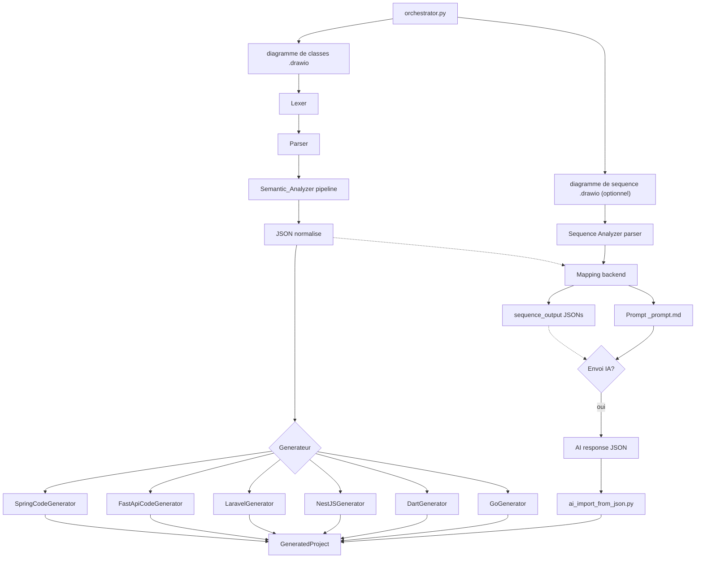

# Project - Overall Flow

Description: Flux general du projet depuis les diagrammes UML jusqu'a la generation de code et l'import IA optionnel.

```mermaid
flowchart TD
    Orchestrator["orchestrator.py"] --> ClassDiagram["diagramme de classes .drawio"]
    Orchestrator --> SeqDiagram["diagramme de sequence .drawio (optionnel)"]

    ClassDiagram --> Lexer["Lexer"]
    Lexer --> Parser["Parser"]
    Parser --> SemPipeline["Semantic_Analyzer pipeline"]
    SemPipeline --> NormalizedJSON["JSON normalise"]
    NormalizedJSON --> CodeGen{Generateur}
    CodeGen --> SpringGen["SpringCodeGenerator"]
    CodeGen --> FastGen["FastApiCodeGenerator"]
    CodeGen --> LaravelGen["LaravelGenerator"]
    CodeGen --> NestGen["NestJSGenerator"]
    CodeGen --> DartGen["DartGenerator"]
    CodeGen --> GoGen["GoGenerator"]
    SpringGen --> GeneratedProject["GeneratedProject"]
    FastGen --> GeneratedProject
    LaravelGen --> GeneratedProject
    NestGen --> GeneratedProject
    DartGen --> GeneratedProject
    GoGen --> GeneratedProject

    SeqDiagram --> SeqParser["Sequence Analyzer parser"]
    SeqParser --> Mapping["Mapping backend"]
    NormalizedJSON -.-> Mapping
    Mapping --> SeqOutputs["sequence_output JSONs"]
    Mapping --> Prompt["Prompt _prompt.md"]

    Prompt --> AIPipeline{Envoi IA?}
    SeqOutputs -.-> AIPipeline
    AIPipeline -->|oui| AIResponse["AI response JSON"]
    AIResponse --> Importer["ai_import_from_json.py"]
    Importer --> GeneratedProject
```
