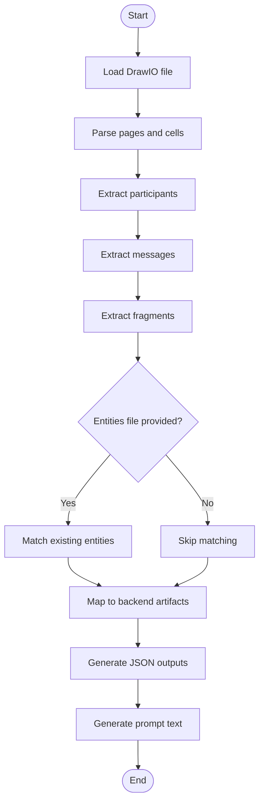

# Technical Sequence Analyzer - Activity Diagram

Description: Etapes principales de traitement d'un diagramme de sequence.

```mermaid
flowchart TD
    A([Start]) --> B[Load DrawIO file]
    B --> C[Parse pages and cells]
    C --> D[Extract participants]
    D --> E[Extract messages]
    E --> F[Extract fragments]
    F --> G{Entities file provided?}
    G -->|Yes| H[Match existing entities]
    G -->|No| I[Skip matching]
    H --> J[Map to backend artifacts]
    I --> J[Map to backend artifacts]
    J --> K[Generate JSON outputs]
    K --> L[Generate prompt text]
    L --> M([End])
```
