# Technical Sequence Analyzer - Architecture

Description: Architecture detaillee des modules, de leurs interactions et des flux de donnees.

```mermaid
flowchart LR
    CLI[main.py] --> DrawIOParser
    CLI --> EntityMatcher
    CLI --> BackendMapper
    CLI --> JSONGenerator
    CLI --> PromptGenerator

    InputDrawio[[input_diagrams/*.drawio]] --> DrawIOParser

    subgraph parser[parser/]
        DrawIOParser[DrawIOParser]
        ParticipantExtractor[ParticipantExtractor]
        MessageExtractor[MessageExtractor]
        FragmentExtractor[FragmentExtractor]
    end

    subgraph utils[utils/]
        XMLHelper[XMLHelper]
    end

    DrawIOParser --> XMLHelper
    DrawIOParser --> ParticipantExtractor
    DrawIOParser --> MessageExtractor
    DrawIOParser --> FragmentExtractor

    subgraph models[models/]
        SequenceDiagram[SequenceDiagram]
        BackendMapping[BackendMapping]
    end

    ParticipantExtractor --> SequenceDiagram
    MessageExtractor --> SequenceDiagram
    FragmentExtractor --> SequenceDiagram

    subgraph mapper[mapper/]
        EntityMatcher[EntityMatcher]
        BackendMapper[BackendMapper]
    end

    EntitiesJson[[entities JSON]] -.-> EntityMatcher
    EntityMatcher -.-> BackendMapper
    SequenceDiagram --> BackendMapper
    BackendMapper --> BackendMapping

    subgraph generator[generator/]
        JSONGenerator[JSONGenerator]
        PromptGenerator[PromptGenerator]
    end

    SequenceDiagram --> JSONGenerator
    BackendMapping --> JSONGenerator
    SequenceDiagram --> PromptGenerator
    BackendMapping --> PromptGenerator

    JSONGenerator --> OutputJson[[*_diagram.json, *_mapping.json, *_complete_analysis_*.json]]
    PromptGenerator --> OutputPrompt[[*_prompt.md]]

    OutputPrompt --> Prompt
    OutputJson --> Mapping
    EntitiesJson -.-> Entities

    subgraph ai_pipeline[ai_pipeline/]
        Prompt["*_prompt.md"]
        Mapping["*_mapping*.json"]
        Entities["*_normalized.json"]
        BuildMsg["build_user_message()"]
        CallModel{Provider}
        CallGemini["call_gemini()"]
        CallClaude["call_claude()"]
        Strip["_strip_markdown_fences()"]
        ParseJson["json.loads()"]
        SaveJson["response.json"]
        Import["ai_import_from_json.py"]
        Copy["copy_with_backup_text()"]
        Backup["next_backup_path()"]
    end

    Prompt --> BuildMsg
    Mapping --> BuildMsg
    Entities --> BuildMsg
    BuildMsg --> CallModel
    CallModel -->|gemini| CallGemini
    CallModel -->|claude| CallClaude
    CallGemini --> Strip
    CallClaude --> Strip
    Strip --> ParseJson --> SaveJson --> Import --> Copy
    Copy --> Backup
    Copy --> OutputProject[[GeneratedProject/]]
```

## Node details

**| Noeud | Correspond a | Contient | Demande | Renvoie |
| --- | --- | --- | --- | --- |
| CLI | `sequence_analyzer/main.py` | Orchestration CLI | args | Execution pipeline |
| InputDrawio | Fichier draw.io | Diagrammes de sequence | *.drawio | XML brut |
| DrawIOParser | `parser/drawio_parser.py` | Parsing pages/cellules | XML | Liste cellules |
| ParticipantExtractor | `parser/participant_extractor.py` | Participants | Cellules | Participants |
| MessageExtractor | `parser/message_extractor.py` | Messages | Cellules | Messages |
| FragmentExtractor | `parser/fragment_extractor.py` | Fragments (alt/opt/loop) | Cellules | Fragments |
| XMLHelper | `utils/xml_helpers.py` | Utilitaires XML | XML | Elements/cellules |
| SequenceDiagram | `models/diagram_model.py` | Modele diagramme | Participants + messages | Diagramme structure |
| EntitiesJson | JSON entites | Classes normalisees | *_normalized.json | Dict entites |
| EntityMatcher | `mapper/entity_matcher.py` | Alignement entites | entites + diagramme | Entites associees |
| BackendMapper | `mapper/*_mapper.py` | Mapping backend | diagramme + entites | BackendMapping |
| BackendMapping | `models/*_model.py` | Artefacts backend | DTO + services | Mapping |
| JSONGenerator | `generator/json_generator.py` | Ecriture JSON | diagramme + mapping | Fichiers JSON |
| PromptGenerator | `generator/prompt_generator.py` | Generation prompt | diagramme + mapping | Texte prompt |
| OutputJson | Sorties JSON | diagram/mapping/complete | modeles | Fichiers JSON |
| OutputPrompt | Prompt texte | Instructions IA | diagramme + mapping | *_prompt.md |
| Prompt | `*_prompt.md` | Instructions + contexte | Fichier prompt | Texte prompt |
| Mapping | `*_mapping*.json` | Controllers/services/repos | Fichiers mapping | Texte JSON |
| Entities | `*_normalized.json` | Entites normalisees | JSON classes | Texte JSON |
| BuildMsg | `ai_pipeline_claude.py` `build_user_message` | Message IA final | prompt + mapping + entities | Texte user_message |
| CallModel | Selection provider | Routage modele | provider | Appel API |
| CallGemini | `call_gemini` | HTTP Gemini | api_key + model | Texte brut |
| CallClaude | `call_claude` | HTTP Claude | api_key + model | Texte brut |
| Strip | `_strip_markdown_fences` | Nettoyage | Texte brut | Texte JSON brut |
| ParseJson | `json.loads` | Parsing JSON | Texte JSON brut | Dict parse |
| SaveJson | `response.json` | Sauvegarde | Dict parse | Fichier JSON |
| Import | `ai_import_from_json.py` | Import fichiers | response.json | Ecriture fichiers |
| Copy | `copy_with_backup_text` | Ecriture fichier | path + content | Fichier ecrit |
| Backup | `next_backup_path` | Backup | Path cible | Path backup |
| OutputProject | GeneratedProject | Projet cible | Fichiers importes | Arborescence mise a jour |**
