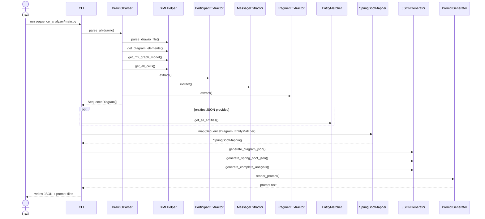

# Technical Sequence Analyzer - Sequence Diagram

Description: Scenario complet depuis le parsing DrawIO jusqu'a la generation du prompt.

```mermaid
sequenceDiagram
    actor User
    participant CLI
    participant Parser as DrawIOParser
    participant XML as XMLHelper
    participant Parts as ParticipantExtractor
    participant Msgs as MessageExtractor
    participant Frags as FragmentExtractor
    participant Match as EntityMatcher
    participant Mapper as SpringBootMapper
    participant JsonGen as JSONGenerator
    participant PromptGen as PromptGenerator

    User->>CLI: run sequence_analyzer/main.py
    CLI->>Parser: parse_all(drawio)
    Parser->>XML: parse_drawio_file()
    Parser->>XML: get_diagram_elements()
    Parser->>XML: get_mx_graph_model()
    Parser->>XML: get_all_cells()
    Parser->>Parts: extract()
    Parser->>Msgs: extract()
    Parser->>Frags: extract()
    Parser-->>CLI: SequenceDiagram[]

    opt entities JSON provided
        CLI->>Match: get_all_entities()
    end

    CLI->>Mapper: map(SequenceDiagram, EntityMatcher)
    Mapper-->>CLI: SpringBootMapping

    CLI->>JsonGen: generate_diagram_json()
    CLI->>JsonGen: generate_spring_boot_json()
    CLI->>JsonGen: generate_complete_analysis()

    CLI->>PromptGen: render_prompt()
    PromptGen-->>CLI: prompt text
    CLI-->>User: writes JSON + prompt files
```
