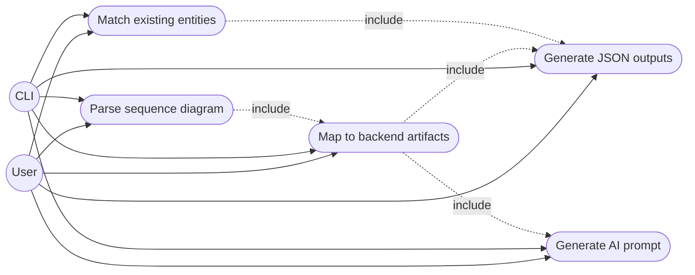

# Technical Sequence Analyzer - Use Case Diagram

```mermaid
flowchart LR
    User((User))
    CLI((CLI))

    Parse([Parse sequence diagram])
    MatchEntities([Match existing entities])
    MapBackend([Map to backend artifacts])
    GenerateJson([Generate JSON outputs])
    GeneratePrompt([Generate AI prompt])

    User --> Parse
    CLI --> Parse

    User --> MatchEntities
    CLI --> MatchEntities

    User --> MapBackend
    CLI --> MapBackend

    User --> GenerateJson
    CLI --> GenerateJson

    User --> GeneratePrompt
    CLI --> GeneratePrompt

    Parse -.->|include| MapBackend
    MapBackend -.->|include| GenerateJson
    MapBackend -.->|include| GeneratePrompt
    MatchEntities -.->|include| GenerateJson
```
